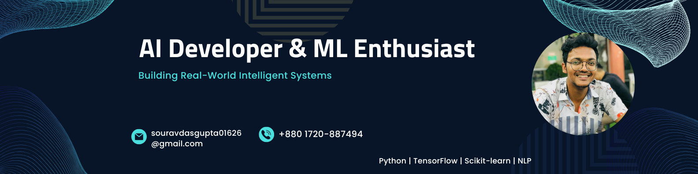

# 💫 About Me:
I’m Sourav Das Gupta, an enthusiastic ICE student at Bangladesh University of Professionals (BUP) with a strong interest in Artificial Intelligence, Machine Learning, and research.  
I enjoy solving problems, building intelligent systems, and exploring how AI can be applied to real-world challenges, especially in healthcare and medical imaging.  
I’m also passionate about competitive programming, software development, and continuous learning.

## 🌐 Socials

🛠️ Current Activities:
<li>🔭 Working on research related to vision-language models for chest X-ray report generation.</li>
<li>🫁 Exploring deep learning approaches for lung cancer detection from CT images.</li>
<li>🌱 Learning advanced AI/ML concepts and research-based development.</li>
<li>🧠 Improving problem-solving skills through competitive programming.</li>
<li>🎬 Working as Scriptwriter & Director at Kittiq.</li>

# 💻 Tech Stack:

# 📊 GitHub Stats:
 
 

---

